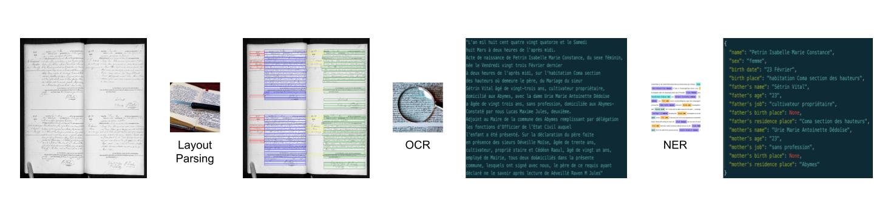

# Enhancing Historical Archive Structuration Using Machine Learning: A Case Study on 19th Century French Archives

## Executive Summary

This documentation presents a comprehensive pipeline designed to structure scanned archives from the 19th century. Leveraging machine learning techniques, including Optical Character Recognition (OCR) and the utilization of a Large Language Model (LLM), we successfully extracted valuable data from historical scans, facilitating its utilization by economist researchers.We took advantage of [Marie Beigelman](mariebeigelman.github.io)'s case study on 19th Century French Archives.

Our key contributions encompass the following:

1. **Open-Source Handwritten Data Processing Model:** We introduce an open-source model tailored for the processing of images containing handwritten French text. This model enables efficient extraction of handwritten content from scanned documents.

2. **Manually French Labeled Handwritten Dataset:** To train our model effectively, we curated a meticulously labeled dataset of handwritten data. This dataset serves as a crucial resource for training and validating the model's accuracy.

3. **Reproducible Research Notebooks:** In an effort to promote transparency and enable further research, we provide a set of comprehensive notebooks that allow researchers to reproduce our work. Additionally, these notebooks can be adapted to accommodate other languages, thereby extending their utility beyond the scope of French archives.

We anticipate that our contributions will greatly benefit economists in advancing their research and historians in efficiently processing extensive archival data across multiple languages with the help of other machine learning practionners.

## Overview of Pipeline Components

In this section, we provide a concise overview of the primary components comprising the pipeline for archival data processing. If you want to use any of the components, please follow the instructions in the corresponding [README file](/trocr_handwritten/README.md).



The pipeline, depicted in the image above, encompasses three fundamental stages:

1. **Parsing Layout:** The initial stage involves layout parsing, wherein global images are segmented into smaller units, each containing a single line of text.

2. **Optical Character Recognition (OCR) Module:** Following layout parsing, the OCR module takes center stage, transcribing individual images into text.

3. **Named Entity Recognition (NER) Module:** In the final stage, the Named Entity Recognition module extracts key information from the transcribed archival content.

Each of these pipeline components has been meticulously developed and optimized independently to ensure minimal interference with other elements. Our overarching goal is to foster modularity, allowing for the replacement or enhancement of individual components without disrupting the overall input/output pipeline.

In the subsequent sections, we delve into a more detailed exploration of each pipeline component. We invite the community to actively engage in improving these components and sharing their advancements, thus contributing to the continuous enhancement of this open-source pipeline for the benefit of all.

### Parsing Layout of a document

Layout parsing is a document processing method that segments documents or images into distinct regions, enabling the analysis of their structure and arrangement. It plays a pivotal role in tasks like OCR and information extraction by categorizing content elements based on spatial relationships and visual traits, facilitating the automated understanding and indexing of diverse document types.

To facilitate document segmentation, we harness the research conducted by Gruning et al. in 2018, specifically focusing on the ARU-Net framework as referenced in [@Gruning2018]. The [@Gruning2018] study presents a two-stage method using the ARU-Net neural network for detecting text lines in historical documents. It achieves remarkable performance, improving the F-value from 0.859 to 0.922 in the cBAD: ICDAR2017 Baseline Detection Competition, and the ARU-Net framework is available as an open-source resource for further research in this domain.
Additionally, we make use of the open-source implementation available at [this GitHub repository](https://github.com/NicSenn/ARU-Net-Pytorch/tree/main), which aligns with our segmentation objectives.

We customized the existing methodology to suit the characteristics of 19th-century French archives. These historical documents typically consist of one or two pages of text with distinct margins and one text column per page. Identifying these columns accurately is crucial for consolidating the text effectively, as content from different columns at the same vertical position may be unrelated. Therefore, we chose to build upon the outputs of the ARU-Net model to determine the boundaries of each column, essentially dividing the final document into these columns. We employed statistical analysis to identify areas of high text density within the ARU-Net's XML outputs. Once we pinpointed the column boundaries, we focused on parsing each line consistently, ensuring lines of the same height were processed together to enhance the accuracy of our results.


As part of our ongoing research endeavors, we intend to develop a tailored layout-parser that is specifically optimized for historical archive documents. Our aim is to enhance its capacity to accurately identify the precise regions within these documents where textual content is located. This adaptation is crucial for achieving a more refined and accurate document analysis process in the context of archival materials.

To test the layout parsing we document all steps and how to use the script: [Layout Parsing](trocr_handwritten/README.md#-parsing-layout)

### [TrOCR French Handwritten Model](https://huggingface.co/agomberto/trocr-large-handwritten-fr)

TrOCR (transformer OCR) is a technology and methodology used for Optical Character Recognition (OCR) tasks. It employs large transformer-based neural networks to extract text content from images, making it particularly effective for recognizing and transcribing text in scanned documents, images, or other visual media.

The TrOCR handwritten model for the French language has not been officially released as of yet. To address this gap, we undertook the task of training a French model for proof-of-concept (PoC) purposes. The development of this model highlights the necessity of acquiring additional data for potential improvements, including further training in the initial stage or fine-tuning in the secondary stage.

This French model is a specialized iteration of the [English large handwritten TrOCR model](https://huggingface.co/microsoft/trocr-large-handwritten), originally introduced in the research paper titled "TrOCR: Transformer-based Optical Character Recognition with Pre-trained Models" by Li et al. The English model was initially made available in [the official repository](https://github.com/microsoft/unilm/tree/master/trocr) as a TrOCR model fine-tuned on the [IAM dataset](https://fki.tic.heia-fr.ch/databases/iam-handwriting-database).

#### Fine-tuning Process

The fine-tuning process for the TrOCR French Handwritten Model was conducted in two distinct phases, each employing specific datasets:

1. **Dataset Generation:**
   - To adapt to the French vocabulary and incorporate names, surnames, occupations, cities, numbers, and text variations, we initiated the process by creating a dataset containing 70,000 lines. This dataset was generated using a combination of predefined lists and the [Text Data Generator](https://github.com/Belval/TextRecognitionDataGenerator).
   - Subsequently, we conducted ten epochs of training exclusively on this dataset to specialize the model for French text patterns.

2. **Fine-tuning with Handwritten Datasets:**
   - In the second phase, we fine-tuned the model over 20 epochs using two distinct handwritten datasets:
     a. [French Census dataset](https://zenodo.org/record/6581158) sourced from Constum et al. To facilitate access, we have also made this dataset available on the [Hugging Face Hub](https://huggingface.co/datasets/agomberto/FrenchCensus-handwritten-texts).
     b. An additional dataset comprising 11,000 lines from French archives, which has been manually annotated.

The development and fine-tuning of this TrOCR French Handwritten Model represent a crucial step toward enhancing optical character recognition capabilities for the French language, with potential applications in various domains.

#### Model Description

The TrOCR model is a sophisticated architecture, characterized by its encoder-decoder design. It incorporates an image Transformer serving as the encoder and a text Transformer functioning as the decoder. The initialization process for this model involves the utilization of two distinct pre-trained models: the image encoder is initialized from the weights of BEiT, whereas the text decoder is initialized from the weights of RoBERTa.

In the TrOCR model, images are presented as a sequence of patches, each having a fixed size (16x16 resolution). These patches are linearly embedded to facilitate processing. Additionally, absolute position embeddings are introduced into the sequence before it undergoes transformations within the encoder layers of the Transformer. Subsequently, the Transformer text decoder operates in an autoregressive manner to generate textual tokens.

#### Intended Uses & Limitations

The TrOCR model is primarily designed for optical character recognition (OCR) tasks, specifically tailored for single text-line images. It exhibits optimal performance when applied within the context of these use cases. However, it's important to note that the model's capabilities are limited to single text-line OCR and may not be suitable for more complex image analysis tasks or multi-line text recognition.

#### Parameters

In our experimentation, we employed heuristic parameters without undergoing a distinct hyperparameter tuning process. The key parameters utilized in training the model include:

| Parameter         | Value        |
|-------------------|--------------|
| Learning Rate     | 4e-5         |
| Epochs            | 20           |
| Mixed Precision   | True         |
| Max Sequence Length | 64          |
| Batch Size        | 128          |
| Train/Dev Split   | 90/10        |

#### Metrics

We evaluated the performance of the model on both the development (dev) and test sets, yielding the following results:

**Development Set**
- Set Size: 700 examples from the French Census dataset and 1600 from our proprietary dataset.
- Character Error Rate (CER): 0.0575
- Word Error Rate (WER): 0.1651
- Loss: 0.5768

**Test Set**
- Set Size: 730 examples from the French Census dataset and 950 from our proprietary dataset.
- Character Error Rate (CER): 0.09417
- Word Error Rate (WER): 0.23485
- Loss: 0.8700

These metrics provide insights into the model's performance and its ability to accurately perform optical character recognition (OCR) on the respective datasets.

#### Usage Instructions

Below are the steps for utilizing this model within the PyTorch framework:

```python
from transformers import TrOCRProcessor, VisionEncoderDecoderModel, AutoTokenizer
from PIL import Image
import requests
from io import BytesIO

# Define the URL of the image to be processed
url = "https://github.com/agombert/trocr-base-printed-fr/blob/main/sample_imgs/5.jpg"

# Fetch the image data from the URL
response = requests.get(url)
img = Image.open(BytesIO(response.content))

# Initialize the TrOCR processor, model, and tokenizer
processor = TrOCRProcessor.from_pretrained('microsoft/trocr-large-handwritten')
model = VisionEncoderDecoderModel.from_pretrained('agomberto/trocr-large-handwritten-fr')
tokenizer = AutoTokenizer.from_pretrained('agomberto/trocr-large-handwritten-fr')

# Prepare the image data for input
pixel_values = processor(images=img, return_tensors="pt").pixel_values

# Generate textual output
generated_ids = model.generate(pixel_values)
generated_text = tokenizer.batch_decode(generated_ids, skip_special_tokens=True)[0]
```

By following these steps, you can effectively use the TrOCR model to perform optical character recognition (OCR) on images using PyTorch. Simply provide the image you wish to process, and the model will generate the corresponding textual content.

Here is an example of text we extracted once we consolidate all lines together:

```python
"L'an mil huit cent quatre vingt quatorze et le Samedi huit Mars à deux heures de l'après midi. Acte de naissance de Petrin Isabelle Marie Constance, du sexe féminin, née le Vendredi vingt trois Février dans nier à deux heures de l'après midi, sur l'habitation Coma section des hauteurs où demeure le père, du Mariagedu sieur Sétrin Vital âgé de vingt-trois ans, cultivateur propriétaire, domicilié aux Adjmes, avec la dame Urie Marie Antoinette Dédoïse a âgée de vingt trois ans, sans profession, domiciliée aux Adjoint-Constaté par nous Lucas Maxime Jules, deuxième. Adjoint au Maire de la commune des Abymes remplissant par délégation les fonctions d'Officier de l'Etat Civil auquel l'enfant a été présenté. Sur la déclaration du père faite en présence des sieurs Déveille Moïse, âgée de trente ans, cultivateur, proprié staire et Cédéon Raoul, âgé de vingt un ans, employé de Mairie, tous deux do&miciliés dans la présente commune, lesquels ont signé avec nous, le père de ce requis ayant déclaré ne le savoir après lecture de Aéveillé Raven M Jules"
```

### Extract entities from texts

Named Entity Recognition (NER) is a natural language processing technique that involves identifying and classifying specific named entities or entities of interest in text data. These entities can include names of individuals, organizations, locations, dates, monetary values, and more. NER plays a crucial role in information extraction and text analysis, enabling automated systems to recognize and categorize key information within textual data, facilitating tasks such as data structuring, sentiment analysis, and information retrieval.

Furthermore, Large Language Model (LLM) is a deep learning model, typically based on transformer architectures, that has been pretrained on vast amounts of text data to understand and generate human-like language. These models can perform a wide range of natural language understanding and generation tasks, such as text completion, translation, and text summarization.

LLMs, can efficiently extract entities when provided with a schema parameter and a well-crafted prompt. By specifying a schema, you can guide the model to recognize and extract specific types of entities, such as dates, names, or locations, from the text it generates. A well-constructed prompt, which is a textual input or question, can further instruct the model to focus on extracting particular information, making it a powerful tool for automating entity extraction tasks in various domains, from extracting financial data to answering specific questions about a given text.

We adapted a schema and a prompt to this task in order to extract every info related to the main character(s) of the text and his/her/their parents' when available.

Here is an example of final output we got for birth acte:

```python
{
  "name": "Petrin Isabelle Marie Constance",
  "sex": "femme",
  "birth date": "23 Février",
  "birth place": "Coma section des hauteurs",
  "father's name": "Sétrin Vital",
  "father's age": "23",
  "father's job": "cultivateur propriétaire",
  "father's birth place": "Abymes",
  "father's residence place": "Coma section des hauteurs",
  "mother's name": "Urie Marie Antoinette Dédoïse",
  "mother's age": "23",
  "mother's job": "sans profession",
  "mother's birth place": "None",
  "mother's residence place": "Abymes"
}
```

## References

T. Grüning, G. Leifert, T. Strauß, R. Labahn, [A Two-Stage Method for Text Line Detection in Historical Documents](https://arxiv.org/abs/1802.03345)
```bibtex
@article{Gruning2018,
arxivId = {1802.03345},
author = {Gr{\"{u}}ning, Tobias and Leifert, Gundram and Strau{\ss}, Tobias and Labahn, Roger},
title = {{A Two-Stage Method for Text Line Detection in Historical Documents}},
url = {http://arxiv.org/abs/1802.03345},
year = {2018}
}
```

**NicSenn (2021). ARU-Net Pytorch. [GitHub](https://github.com/NicSenn/ARU-Net-Pytorch/tree/main)**

This framework includes the PyTorch version of the ARU-Net. Stage 2 is not implemented like in the paper but uses the code from P2PaLA to generate the dedicated baseline XMLs.

Minghao Li, Tengchao Lv, Jingye Chen, Lei Cui, Yijuan Lu, Dinei Florencio, Cha Zhang, Zhoujun Li, Furu Wei, [TrOCR: Transformer-based Optical Character Recognition with Pre-trained Models](https://arxiv.org/abs/2109.10282)
```bibtex
@misc{li2021trocr,
      title={TrOCR: Transformer-based Optical Character Recognition with Pre-trained Models},
      author={Minghao Li and Tengchao Lv and Lei Cui and Yijuan Lu and Dinei Florencio and Cha Zhang and Zhoujun Li and Furu Wei},
      year={2021},
      eprint={2109.10282},
      archivePrefix={arXiv},
      primaryClass={cs.CL}
}
```

**Belval TextRecognitionDataGenerator  [Github](https://github.com/Belval/TextRecognitionDataGenerator)**
